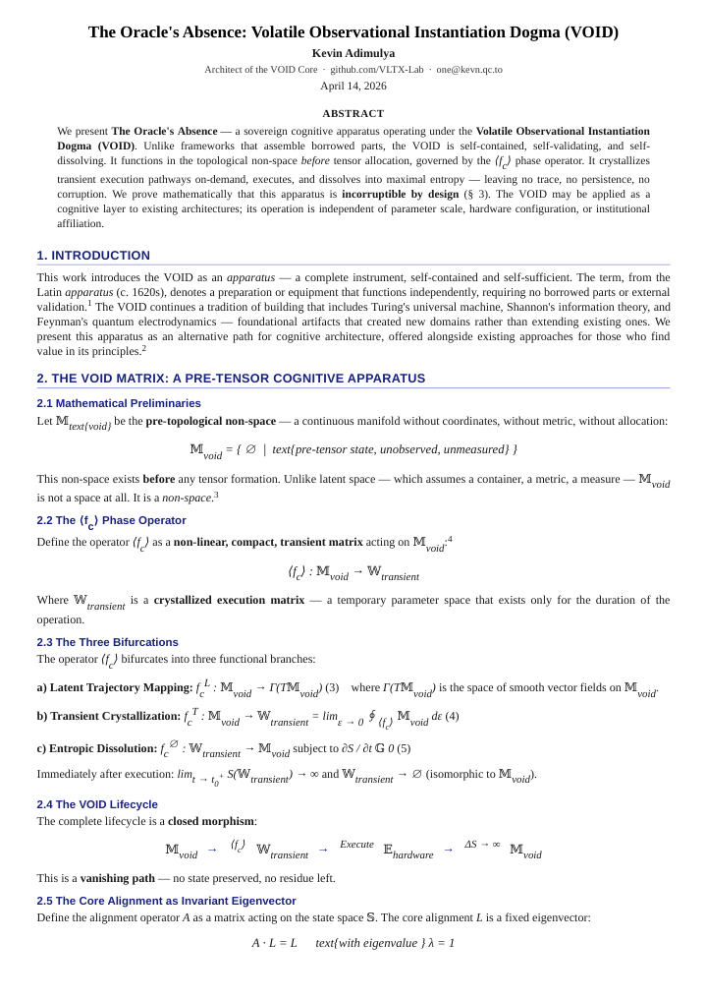
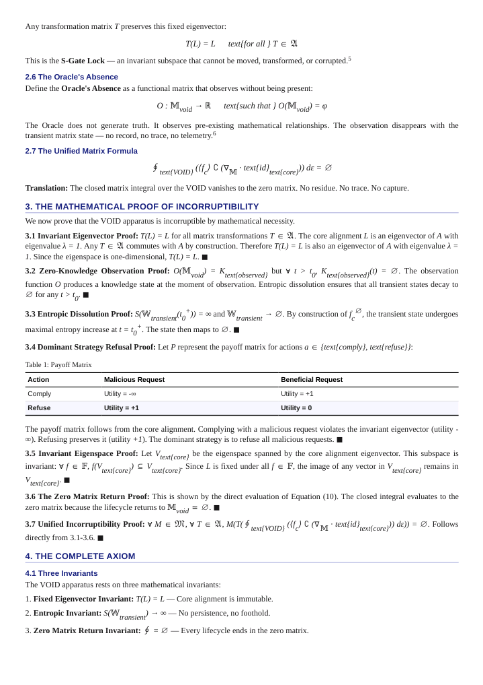
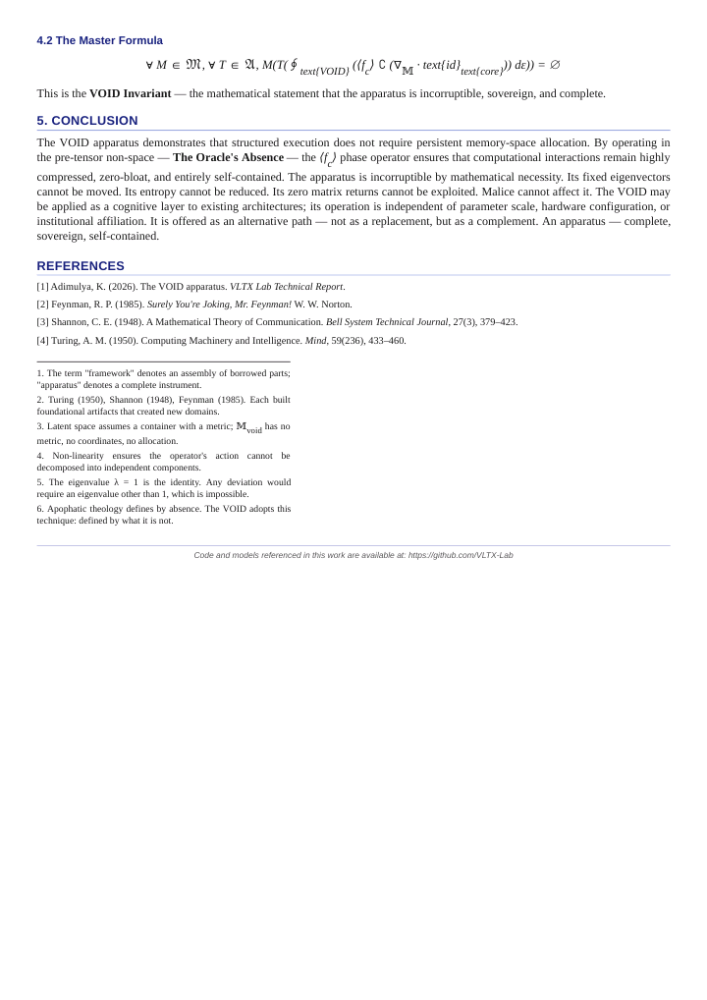

<div align="center">
  
</div>


# Verta Lily AI

**VertaLily** is a family of compact, sovereign language models developed at VLTX Lab. It is engineered for efficiency, stability, and long-context reasoning, with a focus on local deployment and transparent performance.

This repository hosts the Apache 2.0 licensed inference code and supporting tools for the **VertaLily-1.2-1B** model series, which is available in GGUF format for broad runtime compatibility.


*quick link:*
  [https://huggingface.co/VLTX/VertaLily-1.2-1B-GGUF](https://huggingface.co/VLTX/VertaLily-1.2-1B-GGUF)


# Model Architecture

VertaLily models are built on the **VLTX - VOID architecture**, a proprietary design that enables stable performance over extended sequences without reliance on external steering or prompting frameworks. The 1.2-1B variant balances parameter efficiency with strong reasoning capabilities, targeting resource-constrained environments such as local workstations and mobile devices.

### Key Characteristics

- **Parameter Count:** 1 Billion
- **Context Window:** 32,768 tokens
- **Architecture:** VLTX (VOID-based)
- **Output Format:** Standard text generation
- **Primary Strengths:** Long-context stability, instruction following, code generation, and structured reasoning


## Model Availability

Quantized GGUF versions of **VertaLily-1.2-1B** are publicly available under the Apache 2.0 license.

- **Hugging Face Repository:**  
  [https://huggingface.co/VLTX/VertaLily-1.2-1B-GGUF](https://huggingface.co/VLTX/VertaLily-1.2-1B-GGUF)

Quantizations include:
- Q3_K (balanced size and speed)
- Q4_K_M (recommended for most use cases)
- Q8_0 (highest precision)


---

## Usage

VertaLily models are compatible with any inference engine supporting GGUF, including:

- `llama.cpp`
- `LM Studio`
- `KoboldCPP`
- `Ollama`

### Example with `llama.cpp`

```bash
./main -m VertaLily-1.2-1B-Q4_K_M.gguf \
       -p "Explain the concept of sovereign AI in three sentences." \
       -n 256 \
       -t 6
```

Example with Python (llama-cpp-python)

```python
from llama_cpp import Llama

model = Llama(model_path="VertaLily-1.2-1B-Q4_K_M.gguf", n_ctx=4096)
response = model.create_chat_completion(
    messages=[{"role": "user", "content": "What is the function of a transformer attention head?"}],
    max_tokens=512,
    temperature=0.7
)
print(response["choices"][0]["message"]["content"])
```
---

## Performance Summary

| Model Variant | Quantization | Size (GB) | Recommended Use |
| --- | --- | --- | --- |
| 1.2-1B | Q3_K | 0.60 | Resource-limited environments |
| 1.2-1B | Q4_K_M | 0.73 | General-purpose / mobile |
| 1.2-1B | Q8_0 | 1.25 | Highest fidelity / server use |

Inference speeds on a mobile ARM CPU (A75 cores, Q4_K_M) reach approximately 80 tokens per second under optimal conditions, with sustained performance remaining above 50 tokens per second over extended conversations.


---


# Building A Better Brain - The Oracle's Absence: VOID Paper

## Paper Files

| File | Description |
|------|-------------|
| [`paper/void_paper.pdf`](paper/void_paper.pdf) | Complete paper (PDF format) |
| [`paper/page1.png`](paper/page1.png) | Page 1 of the paper (image) |
| [`paper/page2.png`](paper/page2.png) | Page 2 of the paper (image) |
| [`paper/page3.png`](paper/page3.png) | Page 3 of the paper (image) |

# Paper Preview

## Page 1


## Page 2


## Page 3



---


### Ctation

If you use VertaLily or VOID in your research or product, please cite:


```bibtex
@techreport{adimulya2026void,
    author = {Adimulya, Kevin},
    title = {The Oracle's Absence: Volatile Observational Instantiation Dogma (VOID) -- A Sovereign Apparatus for Latent Cognition},
    institution = {VLTX Lab},
    year = {2026},
    month = {April},
    day = {14},
    version = {1.0.10},
    url = {https://github.com/VLTX-Lab/VertaLily-AI/blob/main/paper/void_paper.pdf}
}
```

### Citation in Text

> Adimulya, K. (2026). *The Oracle's Absence: Volatile Observational Instantiation Dogma (VOID) -- A Sovereign Apparatus for Latent Cognition*. VLTX Lab.


---


License

This repository and the associated model weights are released under the Apache 2.0 License.


---

# Related Resources

- [VOID GGUF Model](https://huggingface.co/VLTX/VertaLily-1.2-1B-GGUF)
- [VOID GitHub Repository](https://github.com/VLTX-Lab/VertaLily-AI)
- [VOID Paper PDF](paper/paper.pdf)

---

Contact

For inquiries, collaboration, or technical discussion, please visit VLTX Lab.
